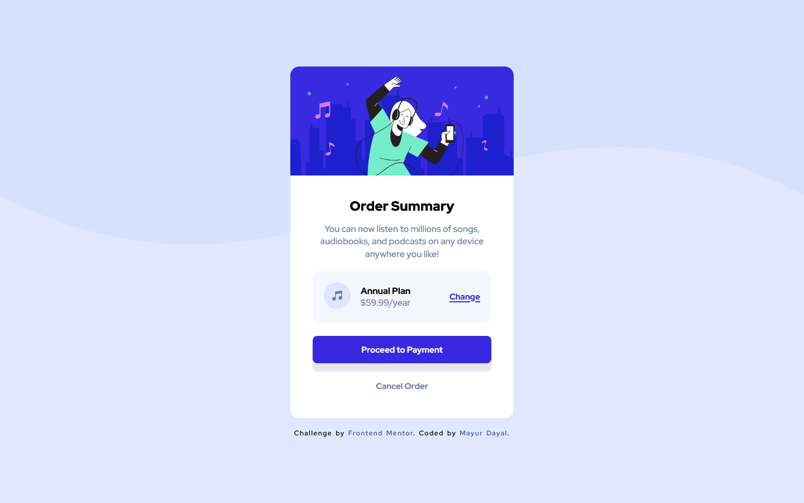

# Frontend Mentor - Order summary card solution

This is a solution to the [Order summary card challenge on Frontend Mentor](https://www.frontendmentor.io/challenges/order-summary-component-QlPmajDUj). Frontend Mentor challenges help you improve your coding skills by building realistic projects. 

## Overview

### The challenge

Users should be able to:

- See hover states for interactive elements

### Screenshot

#### Mobile

 

#### Desktop

### Links

- Solution URL: [https://github.com/mayurDayal5000/order-summary-component-main.git](https://github.com/mayurDayal5000/order-summary-component-main.git)
- Live Site URL: [https://mayurDayal5000.github.io/order-summary-component-main/](https://mayurDayal5000.github.io/order-summary-component-main/)

&copy; 2021 mayur